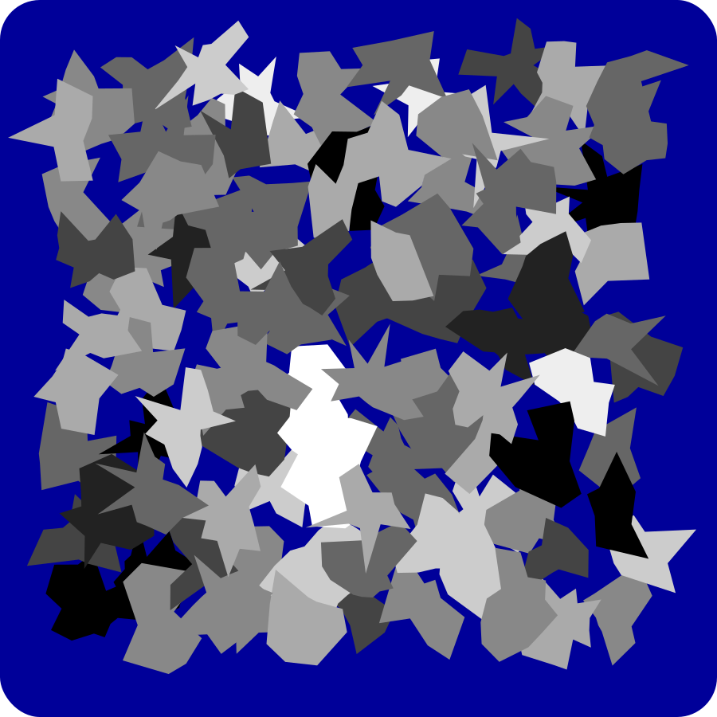
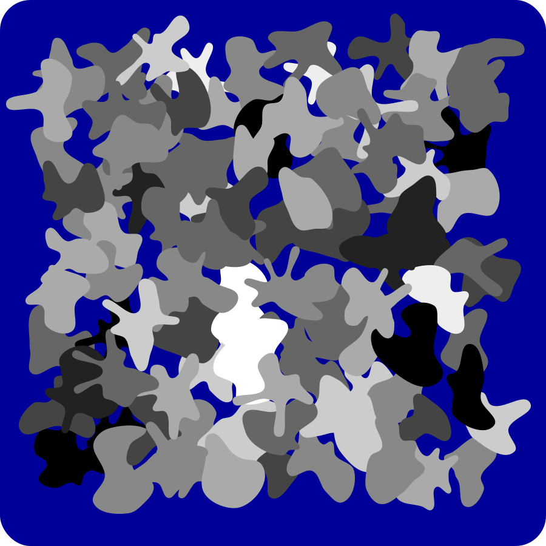
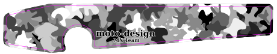
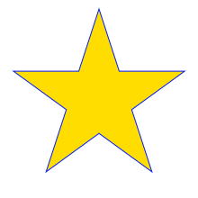
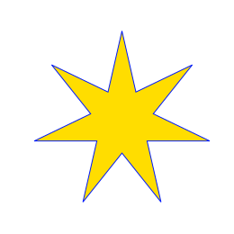

# moto-design SVG Generators

Programs for generating Scalable Vector Graphics image files for camouflage blobs, user defined stars, and Kenny Roberts racing srtipes.

See the [INSTALL](INSTALL) file for installation info.

## blob-generator

Generates SVG file of camouflage blobs.

### Blob Samples

## star-generator

Generates SVG file of star.

### Star Samples

## flag-generator

Generates SVG file of American flag.

### Flag Samples

## stripe-generator

Generates SVG file of Yamaha like stripe.

### Stripe Samples

## Licence & Usage

All files in the [mx-graphics project](https://github.com/moto-design/mx-graphics), unless otherwise noted, are covered by the [Fabricators Design License](https://github.com/moto-design/mx-graphics/blob/master/fabricators-design-license.txt).  The text of the license describes what usage is allowed, and what obligations users have if they choose to use any files.
