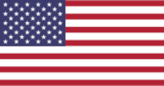
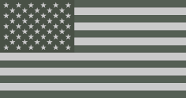
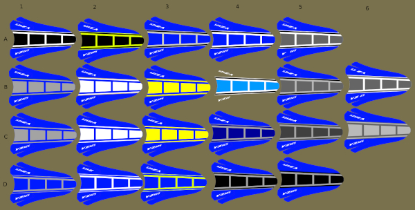

# moto-design SVG Generators

Programs for generating Scalable Vector Graphics image files for camouflage blobs, user defined stars, USA flags, and Yamaha like racing srtipes.

## blob-generator

Generates SVG file of camouflage blobs.

### Blob Samples

## star-generator

Generates SVG file of stars.

### Star Samples

## flag-generator

Generates SVG file of American flags.

### Flag Samples

## stripe-generator

Generates SVG file of Yamaha like stripes.

### Stripe Samples

## Building

To build use commands like these:

./bootstrap 
./configure 
make 
make install

## Licence & Usage

All files in the [svg-generators project](https://github.com/glevand/svg-generators), unless
otherwise noted, are covered by an
[MIT Plus License](https://github.com/glevand/svg-generators/blob/master/mit-plus-license.txt).
The text of the license describes what usage is allowed.
